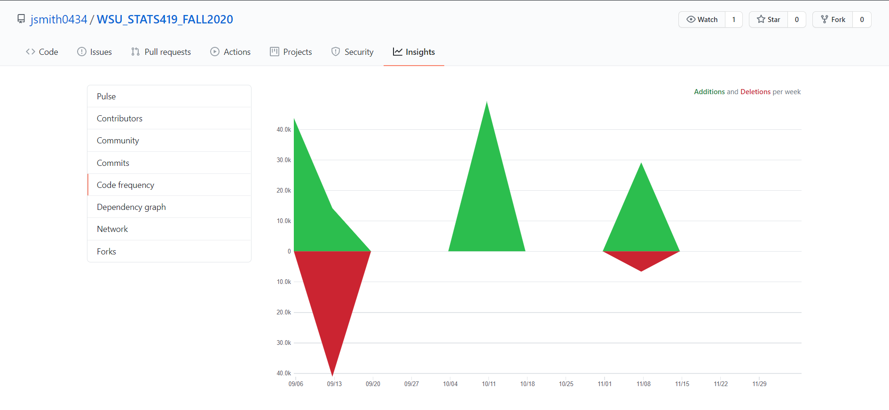
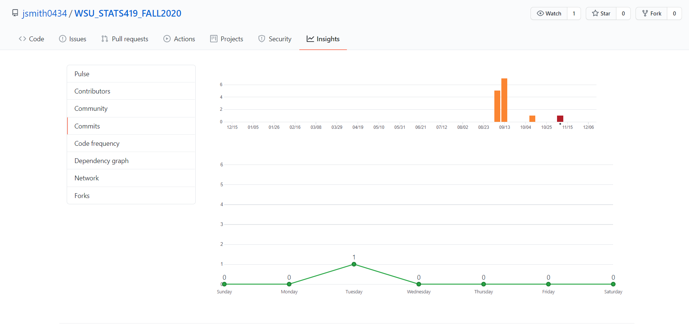
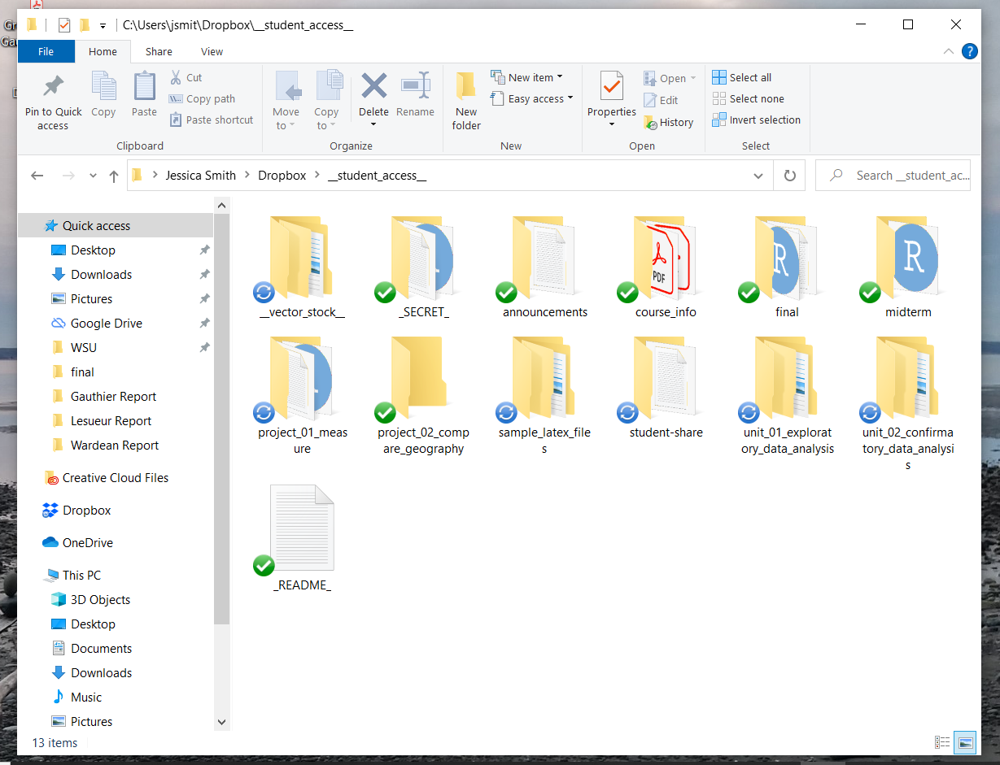
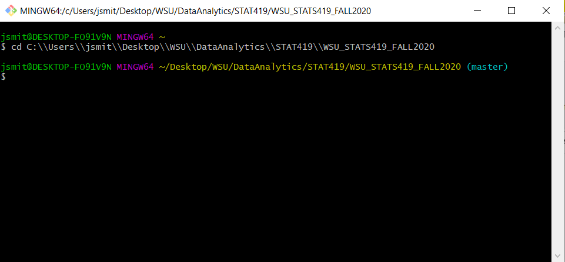

```{r}

library(devtools);

library(humanVerseWSU);

path.github = "https://raw.githubusercontent.com/MonteShaffer/humanVerseWSU/master/";

include.me = paste0(path.github, "misc/functions-nlp.R");
source_url( include.me );
include.me = paste0(path.github, "misc/functions-nlp-str.R");
source_url( include.me );
include.me = paste0(path.github, "misc/functions-nlp-stack.R");
source_url( include.me );
include.me = paste0(path.github, "misc/functions-nlp-pos.R");
source_url( include.me );

include.me = paste0(path.github, "humanVerseWSU/R/functions-encryption.R");
source_url( include.me );


###### UPDATES TO dataframe subset function ######
# inflation adjustments for NA ... and improvements on subsetting
include.me = paste0(path.github, "humanVerseWSU/R/functions-str.R");
source_url( include.me );

include.me = paste0(path.github, "humanVerseWSU/R/functions-file.R");
source_url( include.me );

include.me = paste0(path.github, "humanVerseWSU/R/functions-dataframe.R");
source_url( include.me );

include.me = paste0(path.github, "humanVerseWSU/R/functions-inflation.R");
source_url( include.me );

```

# Workspace Audit

You should place this file in your github local path for this course, in a subfolder called "final" ... for me that is `C:/_git_/WSU_STATS419_FALL2020/final/`;


## Set your WSU id and location of your github USERNAME/REPO
```{r}
wsu.id = "jessica.legarza"; # change this to yours.
github.repository = "jsmith0434/WSU_STATS419_FALL2020";
# be sure to change the notebook title at the top of this document to be "you" based on your wsu.id
```

### Code Frequency on GitHub
Browse to <https://github.com/MonteShaffer/WSU_STATS419_FALL2020/graphs/code-frequency> where you replace my repository name with yours.  Screenshot and include the graphic in this folder, named "github-code-frequency.png".


<div>**Source: <a href="https://github.com/MonteShaffer/WSU_STATS419_FALL2020/graphs/code-frequency">GitHub</a>**</div>


### Commit Frequency on GitHub
Browse to <https://github.com/MonteShaffer/WSU_STATS419_FALL2020/graphs/commit-activity> where you replace my repository name with yours.  Screenshot and include the graphic in this folder, named "github-commits.png". 


<div>**Source: <a href="https://github.com/MonteShaffer/WSU_STATS419_FALL2020/graphs/commit-activity">GitHub</a>**</div>


## General Workspace Environment Data
```{r}
path.to.git.local = "C:/_git_/WSU_STATS419_FALL2020/";
setwd(path.to.git.local);

path.to.git.final = paste0(path.to.git.local,"final/");
```

## General Workspace Environment Data
```{r}
my.object = list();

sg = Sys.getenv();
  snames = names(sg); 
  svals = as.character(sg);
sgdf = as.data.frame(cbind(snames,svals));

my.object$environment = sgdf;

sw = Sys.which(c("ftp", "ping", "texi2dvi", "this-does-not-exist", "make", "latex", "pdflatex", "luatex", "tinytex", "cmd", "git", "python", "pip", "tracert", "traceroute", "VirtualBox", "Dropbox"));
  snames = names(sw); 
  svals = as.character(sw);
swdf = as.data.frame(cbind(snames,svals));

my.object$bin = swdf;
my.object$packages = as.data.frame(installed.packages());

my.object$local.dirs = list.dirs(path.to.git.local,recursive = FALSE);
my.object$local.files = list.files(path.to.git.local,recursive = TRUE);
```

## Local Computer Setup

### Dropbox
Using your file-explorer, browse to your "Dropbox" folder on your computer, enter the "__student_access__" folder for this course, and take a screenshot.  Place in this folder "final/dropbox.png" ...


<div>**Source: LOCAL COMPUTER**</div>

### Git tool

Take a screenshot of your gitbash tool (or if you use Github Desktop, that will do).  Be certain the screenshot is referencing your repository for this course. Place in this folder "final/git.png" ...


<div>**Source: LOCAL COMPUTER**</div>

### Git History

Open your git tool from the command line and browse to the correct folder ...  Type `git status` to verify you are in the right place.

Now type: `git log --shortstat --pretty=format:'%h|%t|%p|%ai|%ae|%an|%ci|%ce|%cn|%N|%f|%s|%b' | paste - - - > final/git-history.log` which will create a file with your git history as a text file.  We will import and perform a basic graph.


```{r}
#  git log --shortstat --pretty=format:'"%h","%an","%ae","%aD","%s",' | paste - - - > final/git-history.log
# git log --oneline --decorate > final/git-history.log
# git log --shortstat --pretty=format:'%h|%t|%p|%ai|%ae|%an|%ci|%ce|%cn|%N|%f|%s|%b' > final/git-history.log
###################################################
############ BELOW IS THE FINAL ANSWER ############
###################################################
# git log --shortstat --pretty=format:'%h|%t|%p|%ai|%ae|%an|%ci|%ce|%cn|%N|%f|%s|%b' | paste - - - > final/git-history.log

# https://mirrors.edge.kernel.org/pub/software/scm/git/docs/git-log.html#_pretty_formats
```

#### Git Log Data
```{r}
my.git = list();

correct_path = "C:\\Users\\jsmit\\Desktop\\WSU\\DataAnalytics\\STAT419\\WSU_STATS419_FALL2020\\final\\"
raw.df = read.csv(paste0(correct_path,"git-history.log"), header=FALSE, sep="|", quote="");
colnames(raw.df) = c("hash","tree","parent","author.date","author.email","author.name","commit.date","commit.email","commit.name","commit.notes","content.f","content.s","content.b");
#raw.df;

total.commits = nrow(raw.df);


date.strings = raw.df$commit.date;
date.types = c("%m","%d","%W","%j","%u","%H");
date.names = c("month", "day", "year.week", "year.day", "day.week","day.hour");   

time.df = convertDateStringToFormat(date.strings, date.types, date.names);
#time.df;

changes.df = NULL;
for(i in 1:total.commits)
  {
  my.commit = removeWhiteSpace(strsplit(raw.df$content.b[i],",",fixed=TRUE)[[1]]);
  
  my.detail = strsplit(my.commit," ",fixed=TRUE);
  
  row = c(0,0,0);
  for(j in 1:length(my.detail))
    {
    val = as.numeric( my.detail[[j]][1] );
    row[j] = val;
    }
  changes.df = rbind(changes.df,row);
  }

changes.df = as.data.frame(changes.df);
colnames(changes.df) = c("file","insert","delete");
#changes.df;

log.df = cbind(raw.df[,c(1:3,7:9,12)], time.df, changes.df);

my.git$raw.df = raw.df;
my.git$total.commits = total.commits;
my.git$time.df = time.df;
my.git$changes.df = changes.df;
my.git$log.df = log.df;

log.df;
```

#### Git Log Graphics

```{r}
plot(log.df$year.day, log.df$file, bty="n", type="l");

plot(log.df$year.day, log.df$insert, bty="n", type="l");

plot(log.df$year.day, log.df$delete, bty="n", type="l");
```

```{r}
weeks = sort(unique(log.df$year.week));
n.weeks = length(weeks);
weeks.file = weeks.insert = weeks.delete = numeric(n.weeks);

days = 1:7;
n.days = length(days);
days.file = days.insert = days.delete = numeric(n.days);

hours = 0:23;
n.hours = length(hours);
hours.file = hours.insert = hours.delete = numeric(n.hours);

for(i in 1:total.commits)
  {
  my.hour = log.df$day.hour[i];
    idx.hour = which(my.hour == hours)[1];
  my.week = log.df$year.week[i];
    idx.week = which(my.week == weeks)[1];
  my.day = log.df$day.week[i];
    idx.day = which(my.day == days)[1];
  
  n.file = log.df$file[i];
  n.insert = log.df$insert[i];
  n.delete = log.df$delete[i];
  
  hours.file[idx.hour]   = hours.file[idx.hour]   + n.file;
  hours.insert[idx.hour] = hours.insert[idx.hour] + n.insert;
  hours.delete[idx.hour] = hours.delete[idx.hour] + n.delete;
  
  days.file[idx.day]   = days.file[idx.day]   + n.file;
  days.insert[idx.day] = days.insert[idx.day] + n.insert;
  days.delete[idx.day] = days.delete[idx.day] + n.delete;
  
  weeks.file[idx.week]   = weeks.file[idx.week]   + n.file;
  weeks.insert[idx.week] = weeks.insert[idx.week] + n.insert;
  weeks.delete[idx.week] = weeks.delete[idx.week] + n.delete;
  }


my.git$groups = list();
my.git$groups$hours = list("hours" = hours, "file" = hours.file, "insert" = hours.insert, "delete" = hours.delete);
my.git$groups$days = list("days" = days, "file" = days.file, "insert" = days.insert, "delete" = days.delete);
my.git$groups$weeks = list("weeks" = weeks, "file" = weeks.file, "insert" = weeks.insert, "delete" = weeks.delete);
my.object$git = my.git;

plot(hours, hours.file,   bty="n", type="l");  # 0 is midnight
plot(hours, hours.insert, bty="n", type="l");
plot(hours, hours.delete, bty="n", type="l");


plot(days, days.file,   bty="n", type="l");    # 1 is Monday
plot(days, days.insert, bty="n", type="l");
plot(days, days.delete, bty="n", type="l");

plot(weeks, weeks.file,   bty="n", type="l");  # 36 is August 30, 2020
plot(weeks, weeks.insert, bty="n", type="l");  # https://savvytime.com/week-number
plot(weeks, weeks.delete, bty="n", type="l");

###############################################
### Feel free to improve on the graphics, if you desire, totally optional ...

```

## Conclusive Summary

```{r}
# you need to upload the .rds and .html file after you KNIT ...
saveRDS(my.object, paste0(correct_path,"workspaceAudit.rds") );
```

This audit is worth 50 points.  Based on your activity in the workspace, self-assess how many points you merit.  Mastery is perfection at 50 points; Developing is about 40 points; Nascent is about 30 points.  Justify your decision based on the consistency of your use of the tools and workspace throughout the semester.

Be certain to review the graphs and include self-reflective commentary on your work habits: day of week, hour of day, and so on.

<pre style="font-weight: bold; font-family: monospace; white-space: pre-wrap; background-color: #717171; border: 2px solid #981e32;">
-- WRITE SOMETHING HERE --

I have a few comments to provide some context on my perspective before I justify why I deserve 50 points for the audit. There were no formal requirements stated at the beginning of the course or anytime this semester regarding 1) Having dropbox installed on the desktop or 2) needing to commit a certain number of times or with any regularity. My use of my git repo for this course corresponds with the dates that assignments were given that required a push to git. I'll make the assumption that the instructor's intent was to get students familiar with using git since it's a widely respected tool. I'd like to mention that other courses in the DA major require GIT, and I have experience using it from those courses and also from building and hosting my website. I'll also make the assumption that the instructor thinks that although the course requirements and expectations have changed over the term, that students have a clear understanding of what the expectations are. This has not been my experience. Students who go to office hours get access to information that isn't provided elsewhere. It's obvious from this assignment that the professor expected students to be pushing to git regularly, but this wasn't ever communicated. I deserve all 50 points because I have my workspace set up as described in the introductory videos in the first few weeks. I also have committed and pushed content as required by the assignments that were given. There have been large gaps in time where nothing was assigned and any notebooks or videos that were published were optional and/or didn't require a student submission. My activity on git and the corresponding graphs reflect this. Several times this semester the professor referenced that it students "should" have a dropbox folder on their desktop.  No installation instructions were ever provided, and nowhere in the syllabus or in any of the course materials is it stated that this is required.  I expressed several times in interactions that I didn't know what he meant or how to do that, and no additional guidance or assertion that it was a requirement was communicated. I'm also unclear about whether the 50 points are for completing this notebook, or for the professors evaluation of the students use of the course tools. The requirements for this course have been consistently unclear and the communication has ranged from poor to non existent. Based on what was stated in the available course materials (assignments, blackboard discussions, announcements, emails, and the syllabus), I've done everything that was asked and assigned. I don't doubt the intention was there on behalf of the instructor, but the reality is that any additional expectations may have been expressed verbally to a few students, but were never communicated to the entire class in a clear and recognizable way. This course lacks a single source of truth for where to find information on the course requirements, schedule, and expectations.


</pre>
